# 🍕 Bella Massa - Sistema de Gerenciamento de Pedidos

## 1. Cenário

A pizzaria **Bella Massa** está passando por um processo de expansão e necessita de um sistema para automatizar o gerenciamento de clientes, pedidos, entregas, ingredientes adicionais e programa de fidelidade.

O sistema foi projetado para atender às seguintes necessidades:

- Cadastro de clientes e múltiplos telefones de contato;
- Controle do cardápio de pizzas e bebidas;
- Registro de ingredientes adicionais nos pedidos;
- Gerenciamento de pedidos e cálculo automático do valor total;
- Controle de entregas realizadas pelos motoboys;
- Programa de fidelidade para clientes VIP.

---

## 2. Modelagem Conceitual

Nesta etapa foi realizada a identificação das entidades, atributos e relacionamentos necessários para representar o cenário da pizzaria.

### Principais Entidades

- **Cliente** – representa o cliente que realiza pedidos na pizzaria;
- **Endereço** – endereço associado ao cliente para fins de entrega;
- **Telefone** – número de contato associado ao cliente;
- **Pedido** – registro de cada compra realizada por um cliente;
- **Produto** – itens disponíveis no cardápio (pizzas e bebidas);
- **Motoboy** – responsável por realizar as entregas dos pedidos;
- **Conta_fidelidade** – programa de pontos exclusivo para clientes VIP.

### Relacionamentos Identificados

- Um **Cliente** pode possuir vários **telefones** de contato;
- Um **Cliente** pode realizar vários **Pedidos**;
- Um **Pedido** contém vários **Produtos** (relação N:N via tabela intermediária `Pedido_produto`);
- Um item do pedido pode possuir vários **ingredientes adicionais**;
- Um **Motoboy** realiza **Entregas**;
- Cada **Pedido** possui uma única **Entrega**;
- Um **Cliente** pode possuir uma **Conta_fidelidade** exclusiva (relação 1:1).

### DER (Diagrama Entidade Relacionamento)

---

## 3. Modelagem Lógica

Após a modelagem conceitual, foi realizada a transformação para o modelo lógico, definindo tabelas, chaves primárias e chaves estrangeiras.

### Tabelas

| Tabela           | Descrição                                              |
|------------------|--------------------------------------------------------|
| `Cliente`        | Armazena os dados dos clientes                         |
| `Endereco`       | Armazena o endereço de entrega do cliente              |
| `Telefone`       | Armazena os telefones associados a cada cliente        |
| `Produto`        | Armazena os itens do cardápio (pizzas e bebidas)       |
| `Pedido`         | Registra os pedidos realizados                         |
| `Pedido_produto` | Tabela associativa entre Pedido e Produto (N:N)        |
| `Ingrediente`    | Ingredientes adicionais vinculados a um item do pedido |
| `Motoboy`        | Dados dos motoboys responsáveis pelas entregas         |
| `Entrega`        | Registra as entregas vinculadas a cada pedido          |
| `Conta_fidelidade` | Conta de pontos exclusiva por cliente               |

### Chaves Primárias (PK)

| Tabela             | Chave Primária       | Tipo   | Observação                          |
|--------------------|----------------------|--------|-------------------------------------|
| `Cliente`          | `id_cliente`         | INT    | Auto incremento                     |
| `Endereco`         | `id_endereco`        | INT    | Auto incremento                     |
| `Produto`          | `id_produto`         | INT    | Auto incremento                     |
| `Pedido`           | `id_pedido`          | INT    | Auto incremento                     |
| `Pedido_produto`   | `id_pedido_produto`  | INT    | Auto incremento                     |
| `Motoboy`          | `cpf`                | CHAR   | CPF utilizado como identificador    |
| `Conta_fidelidade` | `id_conta`           | INT    | Auto incremento                     |

### Chaves Estrangeiras (FK)

| Tabela             | Chave Estrangeira   | Referencia                  | Relacionamento |
|--------------------|---------------------|-----------------------------|----------------|
| `Endereco`         | `id_cliente`        | `Cliente(id_cliente)`       | N:1            |
| `Pedido`           | `id_cliente`        | `Cliente(id_cliente)`       | N:1            |
| `Pedido_produto`   | `id_pedido`         | `Pedido(id_pedido)`         | N:1            |
| `Pedido_produto`   | `id_produto`        | `Produto(id_produto)`       | N:1            |
| `Pedido`           | `cpf_motoboy`       | `Motoboy(cpf)`              | N:1            |
| `Conta_fidelidade` | `id_cliente`        | `Cliente(id_cliente)`       | 1:1            |

### MER (Modelo Entidade Relacionamento)

---

## 4. Modelagem Física

Nesta etapa foi realizada a implementação do banco de dados no SGBD escolhido.

### Criação do Banco

Foi criado o banco de dados destinado ao gerenciamento da pizzaria Bella Massa.

### Criação das Tabelas

Foram criadas todas as tabelas conforme a modelagem lógica, incluindo:

- Chaves Primárias (PK);
- Chaves Estrangeiras (FK);

### Schema Visualizer

Visualização gráfica das tabelas criadas e seus relacionamentos.

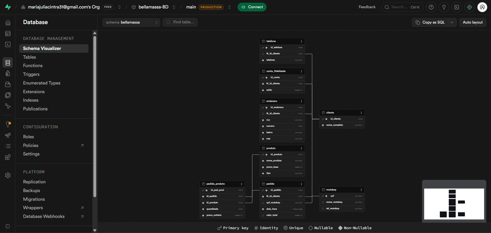

### Conceitos Aplicados

Durante a implementação foram utilizados os seguintes conceitos:

- Modelagem de Dados;
- Integridade Referencial;
- Relacionamentos 1:1 (ex: Cliente ↔ Conta_fidelidade);
- Relacionamentos 1:N (ex: Cliente → Pedido);
- Relacionamentos N:N (ex: Pedido ↔ Produto via Pedido_produto);
- Chaves Primárias e Estrangeiras;
- Normalização de Dados.

---

## 5. CRUD

Foram realizados testes completos de manipulação dos dados utilizando operações CRUD.

### CREATE – Inserção de Dados

Inserção de registros em todas as tabelas do sistema.

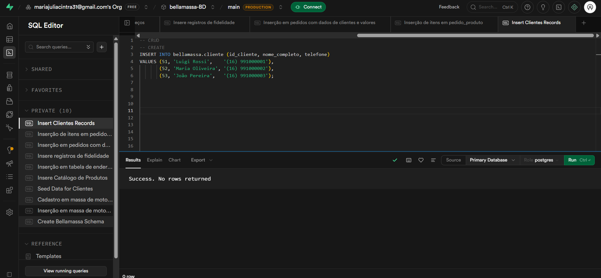

---

### READ – Consulta de Dados

Consultas realizadas para verificar os dados cadastrados:

- Listagem de clientes;
- Buscar de cliente por nome.

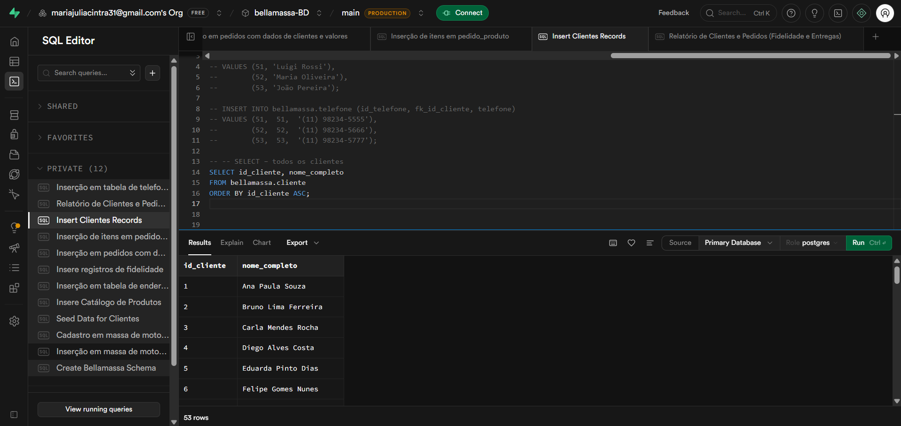
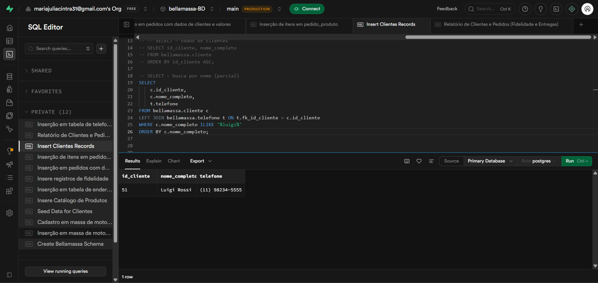

---

### UPDATE – Atualização de Dados

Atualização de informações previamente cadastradas:

- Alteração do telefone do cliente;

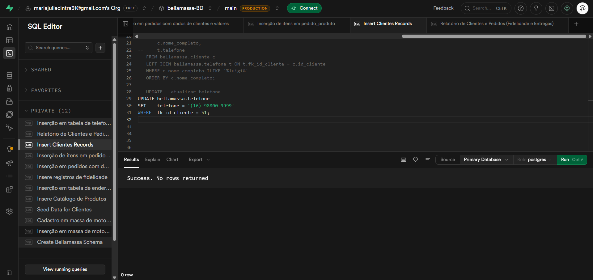
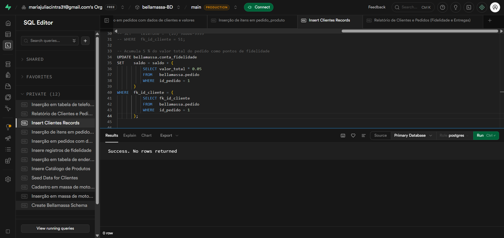

---

### DELETE – Exclusão de Dados

Exclusão de registros:

- Exclusao de cliente

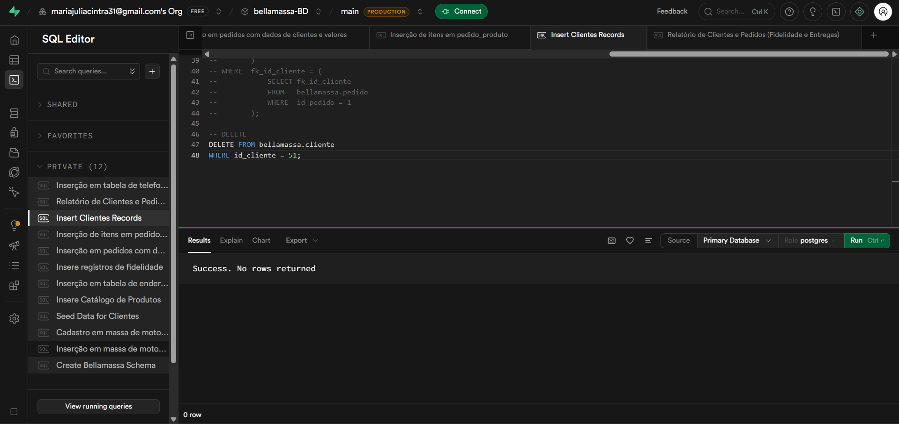

---

## 6. Relatórios

Foram desenvolvidas consultas SQL para extração de informações gerenciais.

### Relatório 1 – Clientes VIP - saldo positivo

**Objetivo:** Visualizar todos os clientes que possuem conta fidelidade com saldo positivo

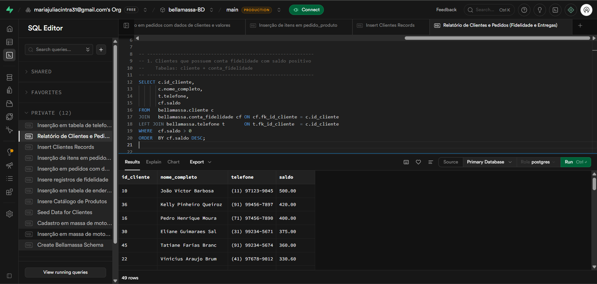

---

### Relatório 2 – Pedidos de maio/2026

**Objetivo:** Visualizar os pedidos realizados em junho de 2026

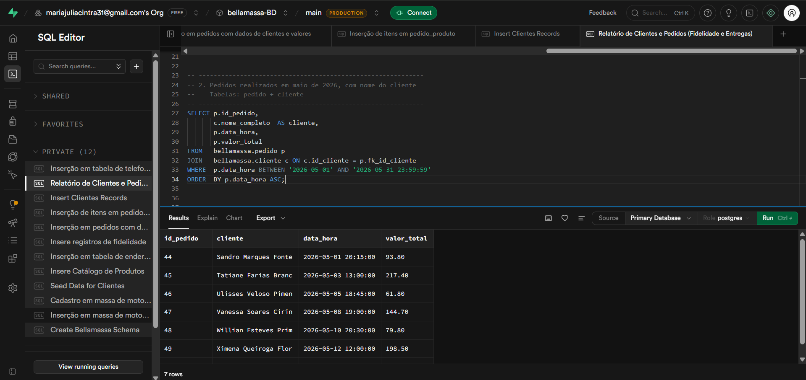

---

### Relatório 3 – Valor unitário

**Objetivo:** Exibir os itens de pedido cujo preço unitário é maior que R$ 40,00.

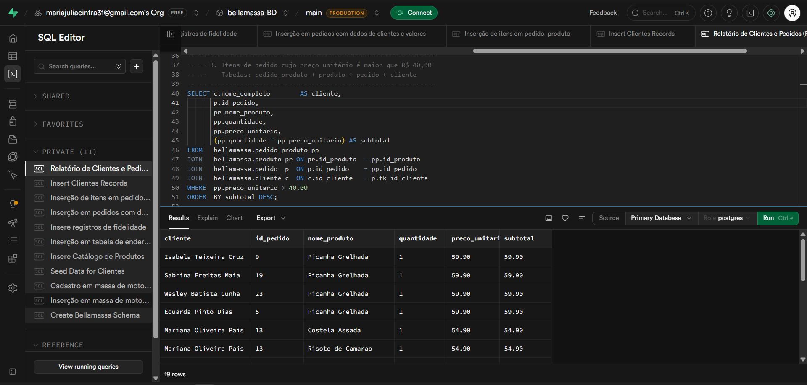

---

### Relatório 4 – Pedido sem motoboy atribuido

**Objetivo:** Listar os pedidos que ainda NÃO foram atribuídos a um motoboy.

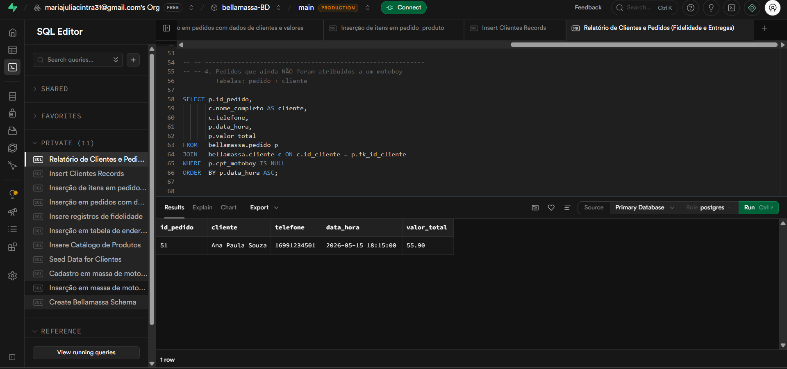

---

### Relatório 5 – Histórico de entregas por motoboy

**Objetivo:** Listar o histórico de entregas por motoboy.

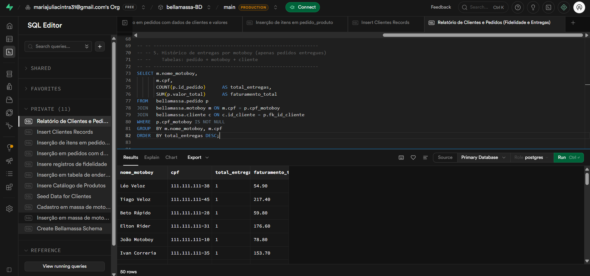

---

### Relatório 6 – Endereços de entrega dos clientes que já fizeram pedidos

**Objetivo:** Listar os endereços dos clientes.

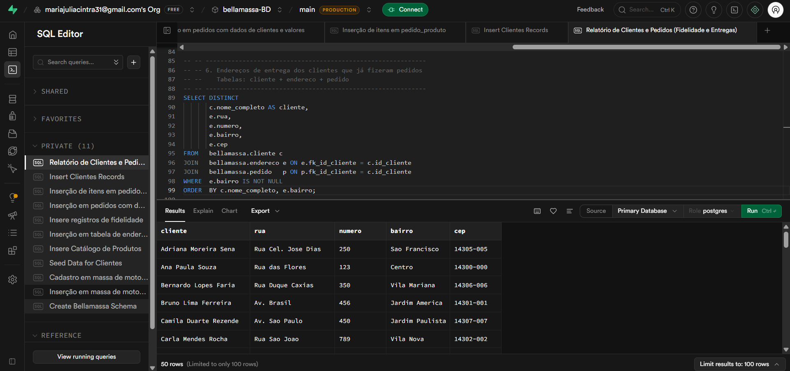

---

### Relatório 7 – Pizzas mais pedidas

**Objetivo:** Listar as pizzas mais pedidas.

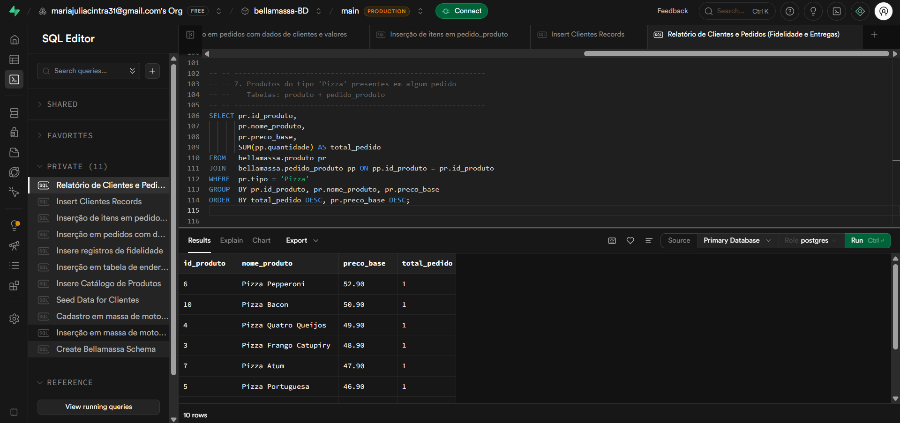

---

### Relatório 8 – Clientes VIP com pedidos acima de R$ 80,00

**Objetivo:** Listar os cliente VIP's com pedidos feitos avima de 80 reais.

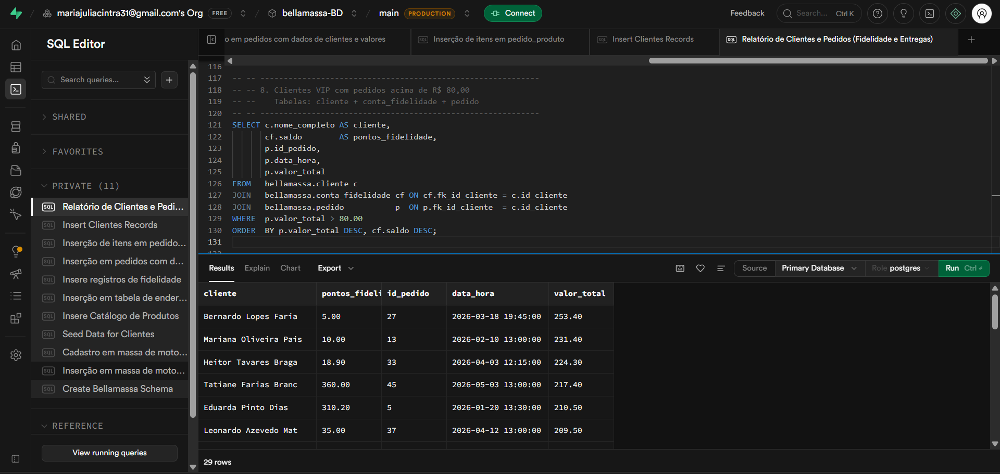

---

### Relatório 9 – Nota fiscal resumida de cada pedido

**Objetivo:** Listar todas as informações nescessário dos pedidos.

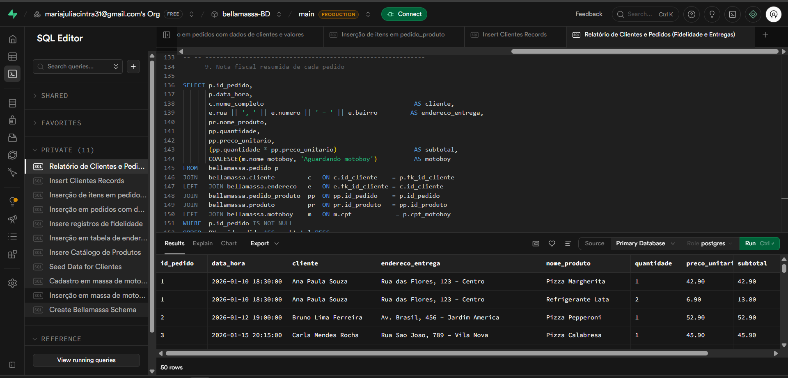

---

### Relatório 10 – Ranking de clientes

**Objetivo:** Listar os cliente com maior valor gasto.

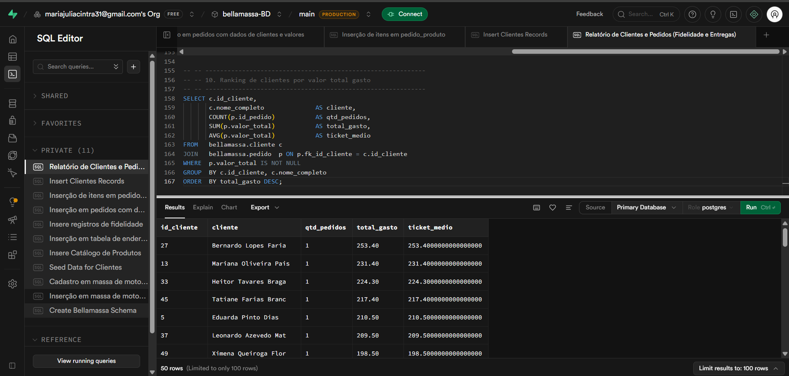

---

## Conclusão

O projeto permitiu aplicar conceitos fundamentais de Banco de Dados, desde a modelagem conceitual até a implementação física e realização de operações CRUD. Foram modeladas 7 tabelas com relacionamentos 1:1, 1:N e N:N, garantindo integridade referencial e normalização dos dados. Além disso, foram desenvolvidas consultas e relatórios capazes de apoiar a gestão da pizzaria Bella Massa, garantindo organização, integridade e eficiência no armazenamento e recuperação das informações.