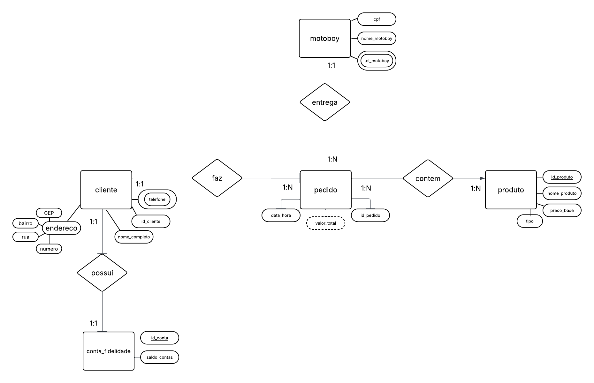
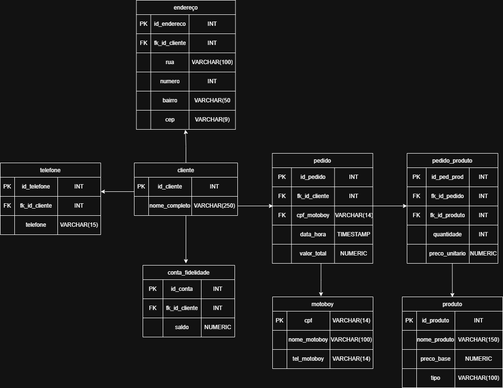
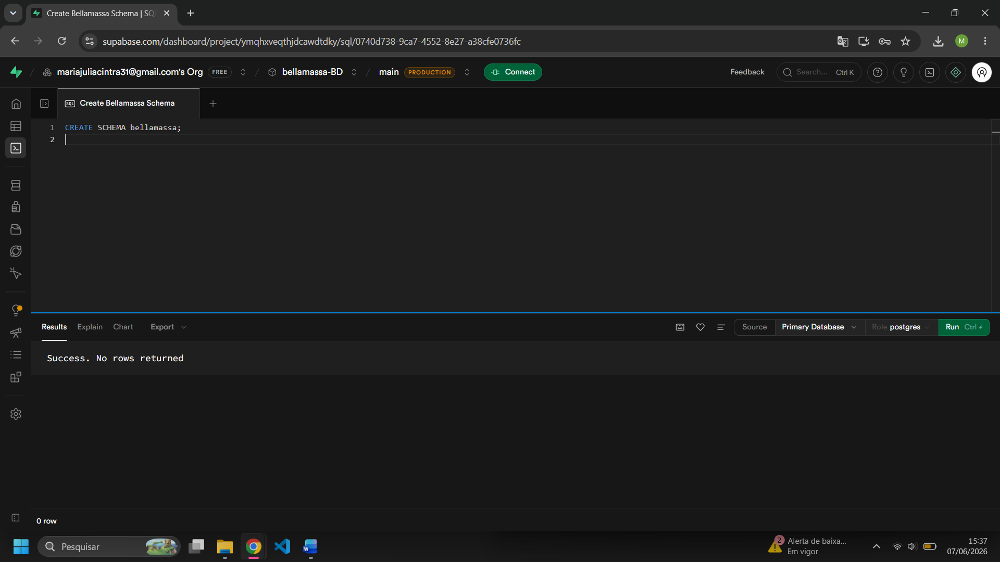
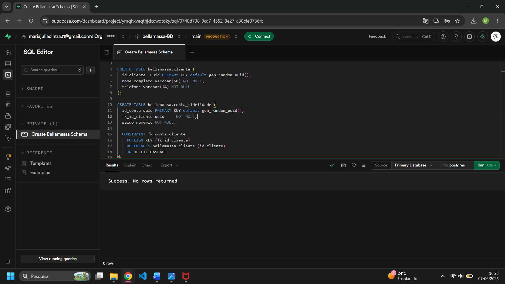

# 🍕 Bella Massa - Sistema de Gerenciamento de Pedidos

## Cenário

A pizzaria **Bella Massa** está passando por um processo de expansão e necessita de um sistema para automatizar o gerenciamento de clientes, pedidos, entregas, ingredientes adicionais e programa de fidelidade.

O sistema foi projetado para atender às seguintes necessidades:

* Cadastro de clientes e múltiplos telefones de contato;
* Controle do cardápio de pizzas e bebidas;
* Registro de ingredientes adicionais nos pedidos;
* Gerenciamento de pedidos e cálculo automático do valor total;
* Controle de entregas realizadas pelos motoboys;
* Programa de fidelidade para clientes VIP.

---

## Modelagem Conceitual

Nesta etapa foi realizada a identificação das entidades, atributos e relacionamentos necessários para representar o cenário da pizzaria.

### Principais Entidades

* Cliente
* Telefone
* Pedido
* Item do Cardápio
* Ingrediente Adicional
* Item do Pedido
* Motoboy
* Entrega
* Conta Fidelidade

### Relacionamentos Identificados

* Um cliente pode possuir vários telefones;
* Um cliente pode realizar vários pedidos;
* Um pedido contém vários itens;
* Um item do pedido pode possuir vários ingredientes adicionais;
* Um motoboy realiza entregas;
* Cada pedido possui uma entrega;
* Um cliente pode possuir uma conta fidelidade exclusiva.

### DER (Diagrama Entidade Relacionamento)

---

## Modelagem Lógica

Após a modelagem conceitual, foi realizada a transformação para o modelo lógico, definindo:

### Tabelas

* Cliente
* Telefone
* Pedido
* Item_Cardapio
* Ingrediente
* Item_Pedido
* Item_Pedido_Ingrediente
* Motoboy
* Entrega
* Conta_Fidelidade

### Chaves Primárias

Descrever as PKs definidas para cada tabela.

### Chaves Estrangeiras

Descrever as FKs responsáveis pelos relacionamentos entre as tabelas.

### MER (Modelo Entidade Relacionamento)

---

## Modelagem Física

Nesta etapa foi realizada a implementação do banco de dados no SGBD escolhido.

### Criação do Banco

Foi criado o banco de dados destinado ao gerenciamento da pizzaria Bella Massa.

### Criação das Tabelas

Foram criadas todas as tabelas conforme a modelagem lógica, incluindo:

* Chaves Primárias (PK)
* Chaves Estrangeiras (FK)
* Restrições de integridade

### Schema Visualizer

Visualização gráfica das tabelas criadas e seus relacionamentos.

📷 **Inserir print do Schema Visualizer aqui**

### Evidência de Domínio

Durante a implementação foram utilizados conceitos de:

* Modelagem de Dados;
* Integridade Referencial;
* Relacionamentos 1:1;
* Relacionamentos 1:N;
* Relacionamentos N:N;
* Chaves Primárias e Estrangeiras;
* Normalização de Dados.

---

## CRUD

Foram realizados testes completos de manipulação dos dados utilizando operações CRUD.

### CREATE

Inserção de registros em todas as tabelas do sistema.

📷 **Inserir print dos INSERTS aqui**

---

### READ

Consultas realizadas para verificar os dados cadastrados.

Exemplos:

* Listagem de clientes;
* Listagem de pedidos;
* Histórico de entregas;
* Clientes participantes do programa de fidelidade.

📷 **Inserir print dos SELECTS aqui**

---

### UPDATE

Atualização de informações previamente cadastradas.

Exemplos:

* Alteração de endereço de cliente;
* Atualização de saldo de pontos;
* Atualização de preço de item do cardápio.

📷 **Inserir print dos UPDATES aqui**

---

### DELETE

Exclusão de registros para validação da integridade dos dados.

Exemplos:

* Remoção de telefone;
* Exclusão de ingrediente;
* Exclusão de registros de teste.

📷 **Inserir print dos DELETES aqui**

---

## Relatórios

Foram desenvolvidas consultas para extração de informações gerenciais.

### Relatório 1 – Pedidos por Cliente

Objetivo: visualizar todos os pedidos realizados por cada cliente.

📷 **Inserir print do relatório aqui**

---

### Relatório 2 – Histórico de Entregas

Objetivo: identificar qual motoboy realizou cada entrega.

📷 **Inserir print do relatório aqui**

---

### Relatório 3 – Faturamento dos Pedidos

Objetivo: exibir o valor total calculado de cada pedido.

📷 **Inserir print do relatório aqui**

---

### Relatório 4 – Programa de Fidelidade

Objetivo: listar clientes participantes e seus respectivos saldos de pontos.

📷 **Inserir print do relatório aqui**

---

## Conclusão

O projeto permitiu aplicar conceitos fundamentais de Banco de Dados, desde a modelagem conceitual até a implementação física e realização de operações CRUD. Além disso, foram desenvolvidas consultas e relatórios capazes de apoiar a gestão da pizzaria Bella Massa, garantindo organização, integridade e eficiência no armazenamento e recuperação das informações.
